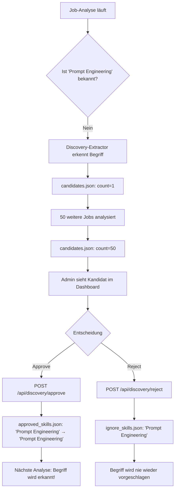

# Discovery & Regelwerk-Management - 7-Ebenen-Verfahren

## ✅ Ja, neue Skills, Rollen, Branchen und Blacklist-Begriffe können dynamisch hinzugefügt werden!

---

## 📊 Aktueller Status

### **Discovery-Dateien** (Python-Backend: `/data/discovery/`)
- ✅ **`candidates.json`** - 3206 Zeilen, automatisch gefüllt durch Discovery-Extractor
- ✅ **`approved_skills.json`** - Manuell freigegebene Skills (z.B. "LLM Prompting" → "Prompt Engineering")
- ✅ **`ignore_skills.json`** - Abgelehnte/ignorierte Begriffe

### **API-Endpunkte** (Kotlin-API: Port 8080)
- ✅ `GET  /api/discovery/candidates` - Alle Discovery-Kandidaten abrufen
- ✅ `GET  /api/discovery/approved` - Freigegebene Mappings
- ✅ `POST /api/discovery/approve` - Neuen Skill freigeben
- ✅ `POST /api/discovery/reject` - Kandidat ablehnen
- ✅ `GET  /api/v1/rules/blacklist` - Aktuelle Blacklist
- ✅ `GET  /api/v1/rules/industry-mappings` - Branchen-Regeln
- ✅ `GET  /api/v1/rules/role-mappings` - Rollen-Regeln

---

## 🔄 Workflow: Vom Discovery bis ins ESCO-Modell

### **Phase 1: Automatische Erkennung (Discovery-Extractor)**

```
Job-Analyse läuft
    ↓
DiscoveryExtractor findet unbekannte Begriffe
    ↓
Kriterien:
  • Nomen oder Eigennamen
  • Mindestens 5 Zeichen
  • NICHT in Blacklist
  • NICHT bereits in ESCO/Fachbuch-Domänen
    ↓
Begriff wird als "Level 1 - Discovery" markiert
    ↓
discovery_logger.py speichert in:
  → /data/discovery/candidates.json
```

**Beispiel**: 
Ein Job enthält "Kubernetes Orchestration" - dieser Begriff ist nicht in ESCO.
→ Wird als Discovery-Kandidat mit `count: 1` gespeichert
→ Bei jedem weiteren Job mit diesem Begriff erhöht sich der Counter

---

### **Phase 2: Review & Freigabe (Manuell oder Dashboard)**

#### **Option A: Manuelles Review**
```bash
# 1. Kandidaten ansehen
curl http://localhost:8080/api/discovery/candidates | jq

# 2. Skill freigeben
curl -X POST http://localhost:8080/api/discovery/approve \
  -H "Content-Type: application/json" \
  -d '{
    "term": "Kubernetes Orchestration",
    "canonicalLabel": "Container-Orchestrierung"
  }'
```

#### **Option B: Dashboard (geplant)**
```
Streamlit-Dashboard zeigt:
  • Top 50 Discovery-Kandidaten (sortiert nach count)
  • Button "Approve" → Mapping wird in approved_skills.json gespeichert
  • Button "Reject" → Term landet in ignore_skills.json
```

---

### **Phase 3: Integration ins System**

**Nach Freigabe:**
```
approved_skills.json wird aktualisiert:
{
  "Kubernetes Orchestration": "Container-Orchestrierung",
  "LLM Prompting": "Prompt Engineering"
}
    ↓
Bei nächster Job-Analyse:
SpaCyCompetenceExtractor lädt approved_skills.json
    ↓
"Kubernetes Orchestration" wird erkannt
    ↓
Gemappt auf ESCO-Label "Container-Orchestrierung"
    ↓
Gespeichert als Level 2 (ESCO) statt Level 1 (Discovery)
```

**Wichtig:** Der neue Begriff ist jetzt Teil der **Wissensbasis** und wird bei zukünftigen Analysen automatisch erkannt!

---

## 🏢 Branchen & Rollen hinzufügen

### **Aktuell: Nur via Code/Datenbank**

**Problem:** Es gibt NOCH KEINE API-Endpunkte zum Hinzufügen neuer Branchen/Rollen.

**Kommentar im Code** ([DomainRuleController.kt](kotlin-api/src/main/kotlin/de/layher/jobmining/kotlinapi/presentation/DomainRuleController.kt#L71)):
```kotlin
// Zukünftige Endpunkte (z.B. POST /rules/blacklist zum Hinzufügen über Admin-UI)
// ...
```

### **Aktueller Workaround:**

#### **1. Branchen-Mappings erweitern**
Datei: `python-backend/data/fallback_rules/industry_mappings.json`
```json
{
  "IT & Software": "Software|Entwicklung|Cloud|IT|Data",
  "KI & Machine Learning": "KI|AI|Machine Learning|Deep Learning|NLP"
}
```

#### **2. Rollen-Mappings erweitern**
Via `OrganizationService._load_fallback_mappings()` oder direkt in Kotlin-DB

#### **3. Blacklist erweitern**
Datei: `python-backend/app/infrastructure/clients/kotlin_rule_client.py`
```python
def _get_static_fallback_blacklist_as_list(self):
    return list({
        "kenntnisse", "fähigkeiten", "kommunikation", 
        # Hier weitere Begriffe hinzufügen
    })
```

---

## 🎯 Zusammenfassung: Was funktioniert?

| Feature | Status | Methode |
|---------|--------|---------|
| **Discovery → ESCO** | ✅ Voll funktionsfähig | Automatisch + API-Review |
| **Skills freigeben** | ✅ `POST /api/discovery/approve` | Manuell/Dashboard |
| **Skills ablehnen** | ✅ `POST /api/discovery/reject` | Manuell/Dashboard |
| **Branchen hinzufügen** | ⚠️ Nur via Code/Datei | Kein API-Endpunkt |
| **Rollen hinzufügen** | ⚠️ Nur via Code/Datei | Kein API-Endpunkt |
| **Blacklist erweitern** | ⚠️ Nur via Code | Kein API-Endpunkt |

---

## 📈 Praktisches Beispiel

### **Szenario:** Neuer Skill "Prompt Engineering" taucht in 50 Jobs auf



---

## 🔮 Geplante Verbesserungen

### **Für Branchen/Rollen/Blacklist:**
```kotlin
// TODO: Implement in DomainRuleController.kt

@PostMapping("/rules/industry")
fun addIndustryMapping(@RequestBody req: AddMappingRequest): ResponseEntity<Void>

@PostMapping("/rules/role")
fun addRoleMapping(@RequestBody req: AddMappingRequest): ResponseEntity<Void>

@PostMapping("/rules/blacklist")
fun addBlacklistTerm(@RequestBody term: String): ResponseEntity<Void>
```

### **Für automatische Discovery-Integration:**
- [ ] Threshold-basierte Auto-Approve (z.B. count > 100 → automatisch freigeben)
- [ ] ML-basierte Ähnlichkeitsprüfung (findet ähnliche ESCO-Labels automatisch)
- [ ] Batch-Approve über CSV-Import

---

## 💡 Nutzung jetzt

### **Skills über Discovery hinzufügen:**
```bash
# 1. Discovery-Kandidaten mit hohem Count finden
curl http://localhost:8080/api/discovery/candidates | jq 'sort_by(-.count) | .[:20]'

# 2. Einen davon freigeben
curl -X POST http://localhost:8080/api/discovery/approve \
  -H "Content-Type: application/json" \
  -d '{"term": "ChatGPT", "canonicalLabel": "Konversations-KI"}'

# 3. System neu starten (oder warten bis nächste Analyse)
docker-compose restart python-backend

# 4. Nächste Job-Analyse erkennt "ChatGPT" automatisch!
```

---

## 📝 Fazit

**JA**, das System unterstützt dynamisches Lernen durch das 7-Ebenen-Discovery-Verfahren:

✅ **Neue Skills** werden automatisch erkannt und können ins ESCO-Modell übernommen werden
⚠️ **Branchen & Rollen** müssen derzeit manuell im Code hinzugefügt werden (API-Endpunkte fehlen)
⚠️ **Blacklist** ist ebenfalls nur via Code erweiterbar

**Die Discovery-Pipeline funktioniert vollständig für Skills** - Sie sammelt automatisch, ermöglicht Review und integriert freigegebene Begriffe ins Wissenssystem!
